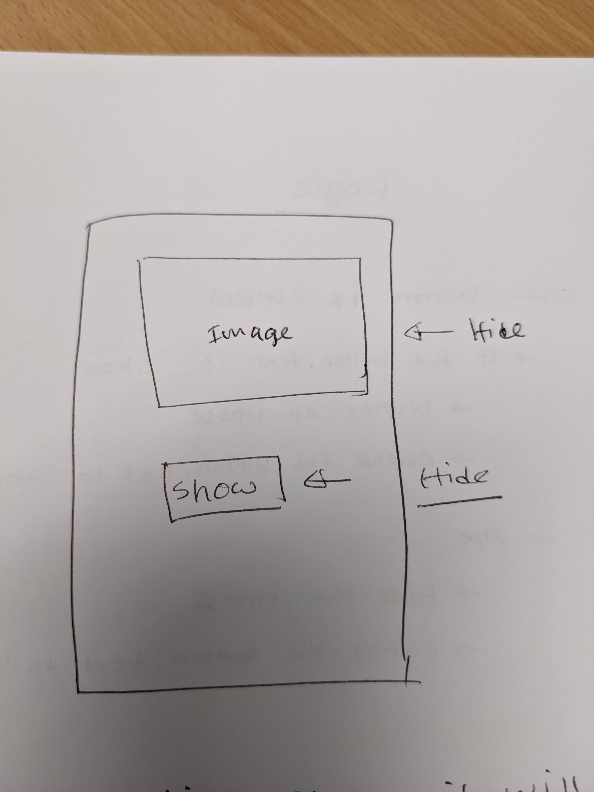
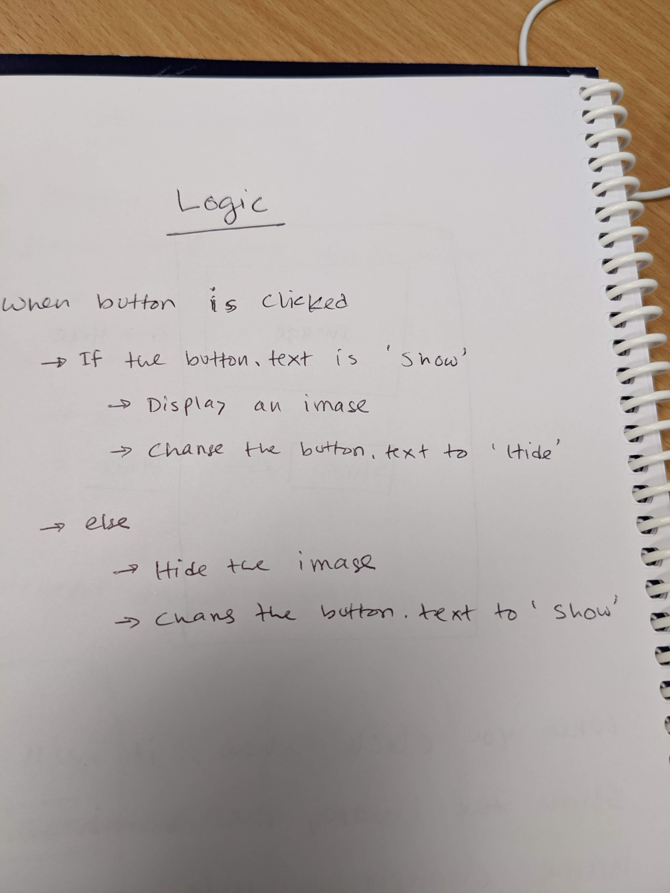

# App tutorial

Welcome to the app development tutorial. This tutorial is intented for begineers who just started exploring app development world with low and no-coding approach. Throughout this tutorial, I will use **MIT App Inventor** website to design and develop an app.

*If you are here only to build and test the app, jump [builing your first app](#building-your-first-app) section.*

### **Things you need**
1. Computer (laptop or desktop) with internet connection
2. A Gmail address to login into the MIT App Inventor website
3. Android phone or tablet for testing the app
4. [MIT AI2 Companion app](https://play.google.com/store/apps/details?id=edu.mit.appinventor.aicompanion3) 
5. Optional: USB cable and [aiStarter](https://appinventor.mit.edu/explore/ai2/setup-emulator.html)

### **Outcome**
If you follow this tutorial, you will be able to:
1. use MIT App Inventor platform
2. design the user interface
3. build the logic
4. test and share the app at least two ways

---
## Setup
You need to setup once only. Depending on availablity of hardware and Internet connectivity, the setup process might differs a bit. However, here are the common steps you need to take to setup your environment.

> You need a Gmail address to login into your account. You can share the same Gmail address with multiple participants. However, **make sure that all sessions are alive.**

> Install [MIT AI2 Companion app](https://play.google.com/store/apps/details?id=edu.mit.appinventor.aicompanion3) from the play store. This app allows you to test your app in an actual Android device.

> Install [aiStarter](https://appinventor.mit.edu/explore/ai2/setup-emulator.html) in your computer should you use a USB cable to connect a tablet with the computer.

---
## Building an app
You need to follow a two-stages principle to build an app. First, you need to design the layout of the app. How it looks like and what user interfaces you need to build it. Second, you need to think about how to make it working, so writing down all logic statements.

### **User interface design**

The first stage is known as **User Interface (UI) design**. In this stage, you not only design the interface but also consider the **User Experience (UX)**. Your design should balance on user experience. Indeed, you are making it for others to use.

To understand the difference between **UI** and **UX** checkout the follow image.
![UI vs UX](https://lh3.googleusercontent.com/amrBfDBgKCbIN8mqHlzEKNBKLHDeDz1YaGDB7GrTlgFAk-SYVcFcTbATzvP6t0BL3VyH9Ipm3sBwD37nK5jVdPKVdJNJf68H8eMkAteFnN7XVYFot0NSrPs1qwE0gCKTejTJ1F-N1WRppaW_LsaG9ASqh-xvvXdtPKtJFJt3DVfCkimxjaX3hBNmFjO16wRCNeoRi0XQ1QhFMSo9fwfFMTa-ygr2GHGWwXcDF0F3gcqqwm-83LhELxZzFhk6LKIGVL00Jmd8RDz5p4sJtYV-QBNrefGWiDo7rtcPGNSKV79cyt-u3FODVv3sfk2pl6Z7qmb972HAcHFtAWxD77lq17eZkEwPZUm7TEfSFzgK_bEe31LZnAxPnl1zgW9-DZ24kukZZliXWC3KF8DI-Ae20iUANqlPd5oHDgWGRKZ5HJi8jdZRbhsQ90XSyqY9HucIt8yB11HUrnFiX_YgWGnUUskOzqdLuDpkMBGzM83SIF_hc30aYFbohnhs8y8r7HLwjYnKgqj0zrsNty5l4JEh_LyrUw5AZEkn7hxHrWVhbCdhjymkTXuI8wsI0KvERcfDEM-oEaL5GozRhkK1ZXccpeEWdDenHDGKnYAFr5jsU4xxtd8l1QvpCD8-p1gGST4RT9lHuhwTzjSPqkF-2MmkwgDjFYxc8GSWlKx6i9107lMZq3RdIMOKeimh6vngLlCNkLw_kFPptlZSqT_AcCU59WYK5ojQdkm_-15my_NY3JZ4e4jx5yDZ75cyIsyhANKFr5kKXPJCKr5IrmSELByhxFmyXCr-m_2E4Je1stts8RTQVYuUduK9aGysf13LZB63JvB41Gctb_LpHZ241zcSKIpApMKmdDLZhsHzOE11wT7GWihD3XEEtGAzbAbdwVCByJrHLwdWoyfqsh7RAYimjGW5OMvr0shiJPJq3WsPUojFMrGuvvDWzn38WEZxfwloXz5o4UE4mjUIvdaIt7b9-JW1kT-o-d2vQ6Zk0QBOBgMqP2hr0PsWZjfzIwl553vMdYvtusQpzBM-vvdrZOLP41fXkGrar2jI8b4yKKCcxhI7pFeQymyvIHYyNz8KrbAf=w590-h735-no?authuser=0)

The top image shows a cute mug, which looks nice and creative. However, the user experience is really bad. While designing the user interface, make a smooth experience for your user, not yourself.

### **App logic**
You have designed an awesome user interface keeping in mind the user experiences. But one problem remains: it does nothing! Now, you need to think about how to make it functional by writing some code. Usually, students are familiar with Scratch based block coding and MIT APP Inventor offers it.

## Building your first app

### **User interface design**

We will start by designing the user interface. Here is a hand-drawn diagram how the interface looks like.

The layout has an image and a button component. Let's build it in the MIT APP Inventor platform. Follow the following steps.

1. Visit [MIT APP Inventor](https://appinventor.mit.edu/)link using the Chrome browser and click on `Create Apps!` button.
2. Use a Gmail address to login into the system.
3. For the first time use, it may show you some intro, you can skip it by ticking off a box.
4. To create an app, click on `Start new project` button and give it a name. You can give any name you would like. However, a better practice would be given it a name that alligns with what the app does.
5. It will take a few moments the prepare the project and once ready you will see the following image.
    > Let's try to understand what is going on here. There are four sections. On your left, you have user interface and layout, separated into different sections.

    > The middle area is where you can drag and drop different things from the left panel. You can change the screen size by switching on different screen sizes.

    > The `Components` panel shows the tree view of all the things you can drag and drop from the left panel. You can rename a component or delete it from here. Just under the `Components`, there is a `Media` panel. You can upload different assests (e.g., images, audio etc.) through it.

    > Finally, the rightmost panel is the `Properties` panel. Depending on what is selected on the screen or at the `Componenta` tree, it will allow you to modify different properties of that component. You can change colour, shape, size and many other behaviours from this panel.
6. Drag and drop an `Image` and a `Button` components on your screen. The secreen should look like the following:
7.  By default, every component snap at the top-left corner. You can change this behaviour by visiting the `Properties` panel. Let's move everything at the center and middle of the screen.
    > Click on the `Screen1` from the `Components` tree.
    
    > Select `Center` for `AlignHorizontal` and `AlignVertical`. Everything should move at the center of the screen.

    > To use the device default theme, scroll down of the `Properties` component and look for `Theme`. Change the theme to `Device Default`
8.  The image component is a place holder, you need to upload an actual image. Go to the `Media` panel and click on `Upload File` and uploads an image file (png or jpge file). You will see no difference as you need to link the newly uploaded file with the image component. 
    > Click on the image icon on the screen or click on `Image1` from the `Components` tree. From the `Properties` panel, click on the `Picture` and select your image file and press `OK`.

    > Depending on the image size, it may take the most of the screen and you may kind of lost the `Button` component. To fix this, you can limit the height of the image. To do it, click on `Height` from the `Properties` panel and give a percentage value (60% works for me) and click `OK`. Now, you should be able to see both components.
9.  Click on the `Text for Button1` on the screen. You will change a few properties of the button too.
    > From the `Properties` panel, click on `Width` and choose `Fill parent` and click `OK`. The button will take the entire screen for its width.

    > From the `Text` property replace the current text with "Hide" without quatation and press enter.
10. **Congratulation!** You have officially finished the design part. Now you need to think about implementing the app logic.

### **App logic**
When you click on the `Hide` button, the app hides the image and changes the  button text to `Show`. Once you click on the `Show` button, the app shows the image and changes the button text to `Hide`. 

The following image shows you the logical breakdown.

To implement the above logic, click on the `Blocks` tab on top of `Properties` panel and follow these steps:

1. Click on `Button1` from `Blocks` panel and drag and drop `when Button1.Click` block.
2. Click on `Control` block and drag and drop `if then else` block inside the `when Button1.Click` block.
3. Click on the `Logic` block and drag and drop the equal block on the if statement.
4. Click on the screen and type Button1.Text and press enter. Move the new block inside the first section of the equal operation.
    > Another option: Click on the `Button1` from the `Blocks` panel and find the block `Button1.Text` and drag and drop it.
5. Click on the screen and type "text". Choose it from the drop down menu and move the block on the second section of the equal operation. Type Hide in empty block. At this stage the code should look like the following:
   
6. Click on the screen and type **set image1** and from the drop down menu choose `Visible`. Type False on the screen and connect it with the set image1 block. Move the entire block inside the if statement.
7. Similarly, set the Button1 text to Show. The following image shows code at this stage.
   
8. Right-click on the first set block and choose `Duplicate`. Move the duplicated block inside the else statement. Change false to true.
9.  Duplicate the other block and move it into the else statement and change the text to Hide. The final code is as follows:
    
10. **Congrats, you are done!!!** Let's test it.

---
## Testing the app
There are a few different ways you can test the app. Here, I will show the easiest way of testing the app. To test the app, **make sure your laptop and tablet/mobile devices are connected on the same Wi-Fi network.**

Follow the following steps to test the app.

1. Click on the `Connect` and choose `AI Companion`. It will generate a QR code. 
2. On your phone/tablet, open the `MIT AI2 Companion` app and click `scan QR code`.
3. Point your camera to the QR code and hold it until it finishes.
4. Your app should load on your mobile device and it shoud work.

---
## Extension activity
You may notice that the show/hide button jumps up and down on the screen when you click on it. Though, it is not a big problem but it does not feel good. Remember what I mentioned earlier about user experiences? You need to provide a smooth experience to your user. Certainly, this app fails to deliver it. So it is time to fix it. Let's do it!

**Caution: You may lose your code if you proceed in the next section. To save your code, go to the `Blocks` tab, right-click on your code and select `Add to Backpack`. This will save the code in the backpack and you can retrive it latter.**

### **Fixing the jumping button**
1. Return to the `Designer` tab and delete the `Image` and the `Button` from the screen. You will have en empty screen again.
   > You may get an warning message similar to the following image. Click on `Save the empty screen now.` button.
2. Click on the `Layout` tab from the left panel and drag and drop two `VerticalArrangement` block on the screen.
   > Layout helps to create a container where you can arrange multiple components. You can arrange multiple buttons in an `HorizontalArrangement` to create a navigation panel and so on.
3. Click on the top container and from the `Properties` panel change the `Height` to 80% and `Width` to *fill parent*.
4. Click on the other container and from the `Properties` panel change the `Width` to *fill parent*.
5. Drag and drop an `Image` component into the top container. Click on the `VerticalArrangement1` from the components panel and align it to center for both horizontal and vertical.
6. Drag and drop a `Button` component into the other container. Click on the `VerticalArrangement2` from the components panel and align it to center for both horizontal and vertical.
7. Click on the `Image` component and choose the uploaded image.
   > You can optionally change the `Height` property of the image if you would like to do so.
8. Change the button `Width` to *fill parent* and change the `Text` to *Hide*.
9. Go to the `Blocks` screen and click on the backpack icon. Drag and drop the code into the code area.
10. **You are done!**. Test it out.