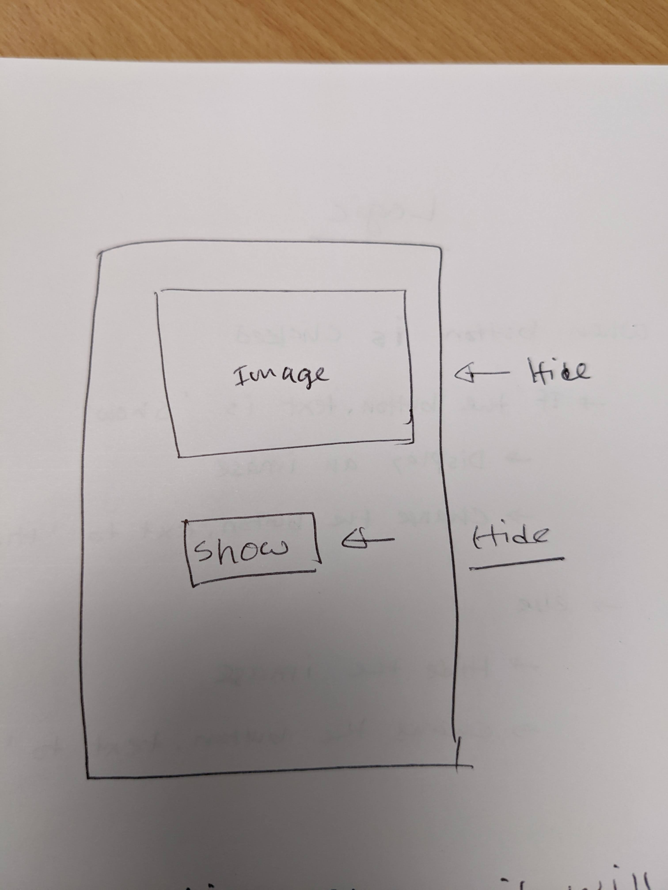
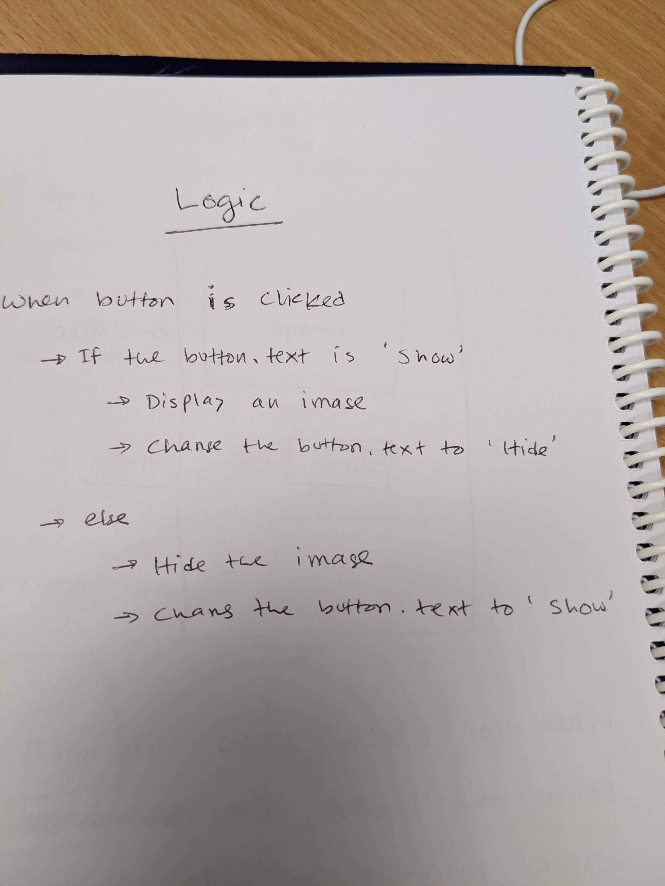
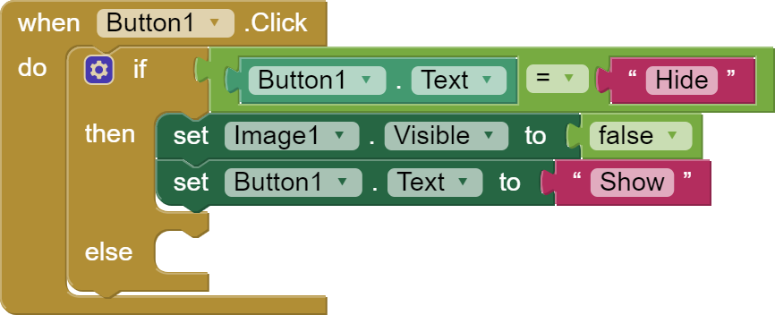
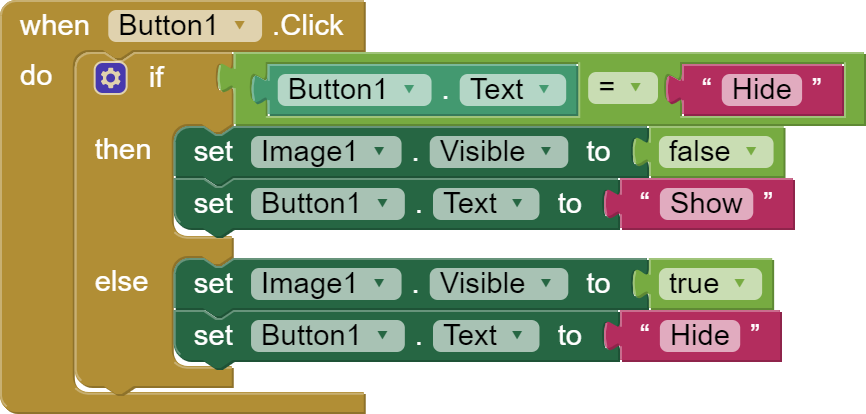
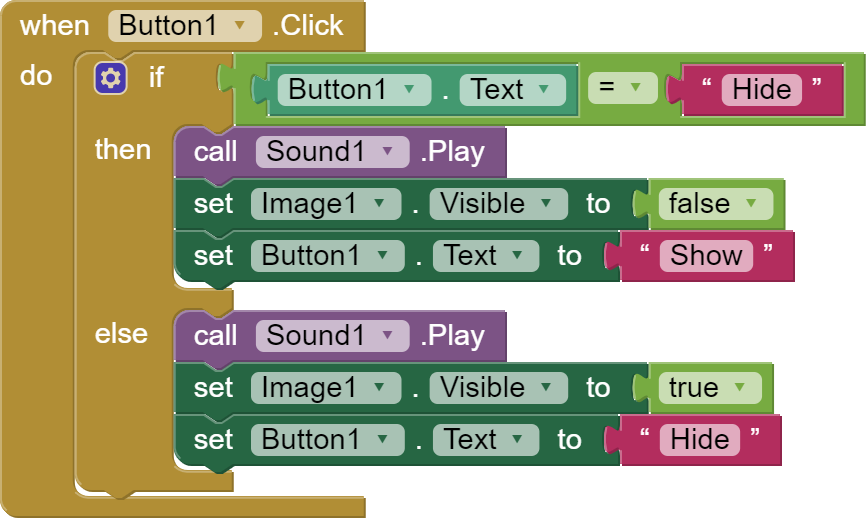

# Tutorial#1: Image Hide-and-Seek

Welcome to our app development tutorial! This guide is tailored for beginners who are just embarking on their exploration of the app development world using a low/no-code approach. Throughout this tutorial, we will be utilising the [MIT App Inventor](https://appinventor.mit.edu/) platform to craft and shape our app.

> [!IMPORTANT]
> If you are solely interested in building and testing the app, feel free to skip ahead to the [Building Your First App section](#building-your-first-app). You can download the project [HERE](./download/tutorial-1.aia) and open it in the MIT App Inventor platform.

## Prerequisites
To get started, make sure you have the following:
1. A computer (laptop or desktop) with internet connection.
2. A Gmail address for logging into the MIT App Inventor website.
3. An Android phone or tablet for testing the app.
4. Install the [MIT AI2 Companion app](https://play.google.com/store/apps/details?id=edu.mit.appinventor.aicompanion3) on your Android device.
5. Optionally, you can use a USB cable and [aiStarter](https://appinventor.mit.edu/explore/ai2/setup-emulator.html).

## Learning Objectives
By the end of this tutorial, you will gain proficiency in:
1. Navigating the MIT App Inventor platform.
2. Designing basic user interfaces.
3. Constructing logical processes based on your designs.
4. Testing and sharing the app through at least two different methods.

# Setup
The setup process is a one-time task, and depending on the availability of hardware and internet connectivity, the steps may vary slightly. However, here are the common steps you need to follow to set up your environment.

1. **Gmail Address:** You will need a Gmail address to log in to your account. Every computer should use unique Gmail address.
> [!CAUTION]
> It is not recommanded to use the same Gmail address to log in into multiple computers. Potentially, you will destroy other people's work.

2. **Install MIT AI2 Companion App:** Head over to the Play Store and install the MIT AI2 Companion app. This app enables you to test your app on an actual Android device.

3. **Install aiStarter:** If you plan to connect a phone/tablet to your computer using a USB cable, install aiStarter on your computer.

These steps, once completed, will ensure that your environment is set up for a smooth app development experience. Remember to adapt the process according to your hardware and internet availability.

# Building your First Mobile App

## User interface design

Let's begin by designing the user interface. Below is a hand-drawn diagram illustrating how the interface should look:

Now, we will guide you through the process of building this interface using the MIT App Inventor platform. Follow these steps:

1. Visit [MIT APP Inventor](https://appinventor.mit.edu/) using a web browser and click on the `Create Apps!` button.
2. Log in using your Gmail address.
3. For the first-time login, it might show you an introduction; you can skip it by ticking off a box.
4. Click on the `Start new project` button, name your project (choose a name aligned with your app's functionality).
5. After a moment, your project will be ready, and you will see the interface with four panels. Let's understand them:
    > 

    > - **Panel 1:** User interface and layout, separated into different sections.
    > - **Panel 2:** Drag-and-drop area for various components, with the option to change screen sizes.
    > - **Panel 3:** Tree view of draggable components. Below it is the `Media` panel for uploading assets.
    > - **Panel 4:** Modify properties of selected components.

6. Drag and drop an `Image` and a `Button` onto your screen, resulting in the following layout:
   
7.  Adjust the components' positions to the center and middle of the screen:
    > - Click on `Screen1` in the `Components` tree.
    
    > - Set `AlignHorizontal` and `AlignVertical` to `Center` in the `Properties` panel.

    > *Optional*: To use the device default theme, scroll down in the `Properties` panel and change the `Theme` to `Device Default`.
8.  The `Image` component is a placeholder; upload an actual image:
    > - Go to the `Media` panel, click `Upload File`, and select `light_on.png` from the `media` folder.

    > - Click on the image icon or `Image1` in the `Components` tree. In the `Properties` panel, click `Picture`, select your image file, and press `OK`.

    >  - To prevent the image from dominating the screen, set its height to a percentage value (e.g., 60%) in the `Properties` panel.
9.  Customise the `Button`:
    > - Click on the `Button` on the screen.
    > - In the `Properties` panel, set the `Width` to `Fill parent`.
    > - Change the `Text` property to *Hide*.
10. **Congratulation!** You have completed the design phase. Now, it's time to think about implementing the app logic.

## App logic
The app logic is responsible for toggling the visibility of the image and updating the button text accordingly. Follow these steps to implement the logic:

1. Navigate to the `Blocks` tab above the `Properties` panel.
2. Click on `Button1` in the `Blocks` panel and drag the `when Button1.Click` block.
3. Drag an `if then else` block from the `Control` section into the `when Button1.Click` block.
4. Drag an equal block from the `Logic` section and drop it into the if statement.
5. Use the `Button1.Text` block from the `Button1` section, placing it in the first section of the equal operation.
6. Drag an empty text block from the `Text` section into the second part of the equal operation. Type *Hide* in the empty block.
   
7. Click on the `Image1` block and drag and drop `set Image1.Visible to` on your screen. From the `Logic` section grab the `False` block. Connect them together.
8. Similarly, click on the `Button1` block and drag and drop `set Button1.Text to` on your screen. From the `Text` section grab the empty text block and type `Show`. Connect them together.
9. Move these two blocks inside the if statement.
   
9. Right-click on the first set block, choose `Duplicate`, and move the duplicated block inside the else statement. Change `False` to `True` and `Show` to `Hide`.
10. Duplicate the other block, move it into the else statement, and change the text to *Hide*. The final code is as follows:
    
11. **Congratulations, you are done!** Test your app to see the logic in action.

## Testing the app
Testing your app is a crucial step in ensuring its functionality. Here is the simplest way to test your app. Ensure that your laptop and tablet/mobile devices are connected to the same Wi-Fi network.

Follow these steps to test the app:
1. Click on `Connect` and select `AI Companion`. This action generates a QR code.

    

2. Open the `MIT AI2 Companion` app on your phone/tablet and choose `Scan QR code`.
3. Point your camera at the QR code and hold it until the scanning process is complete.
4. Your app should load on your mobile device, and it should now be operational.

This method provides a quick and efficient way to test your app on a physical device, allowing you to experience its functionality as intended.

## Extension activity 1: Improving button stability
While testing your app, you might have observed that the show/hide button exhibits a noticeable jump on the screen when clicked. Although it may seem minor, delivering a seamless user experience is crucial. Let's address this issue and enhance the app's usability.

> [!CAUTION]
> **Proceeding may result in code loss. To safeguard your code, navigate to the `Blocks` tab, right-click on your code, and select `Add to Backpack`. This action saves the code in the backpack for retrieval later.**

### Fixing the jumping button issue
1. Return to the `Designer` tab and remove the `Image` and `Button` from the screen, leaving it empty.
   > You may encounter a warning message; click on `Save the empty screen now.` to proceed.

   > 

2. Click on the `Layout` tab in the left panel (Panel 1) and drag two `VerticalArrangement` blocks onto the screen.
   > Layouts serve as containers for arranging multiple components, facilitating the organisation of buttons, navigation panels, etc.
3. Adjust the properties of the first container: set `Height` to 80% and `Width` to *fill parent*.
4. Modify the properties of the other container: set `Width` to *fill parent*.
5. Drop an `Image` component into the first container. Click on `VerticalArrangement1` in the components panel and align it to the center both horizontally and vertically.
6. Place a `Button` component into the other container. Click on `VerticalArrangement2` in the components panel and align it to the center both horizontally and vertically.
7. Click on the `Image` component and select the uploaded image.
   > Optionally, adjust the `Height` property of the image if needed.
8. Set the button's `Width` to *fill parent* and change the `Text` to *Hide*.
9. Navigate to the `Blocks` screen and click on the backpack icon. Drag and drop the saved code into the code area.
10. **You are done!** Test the app to ensure the button now operates smoothly without any jumping issues.

## Extension activity 2: Adding sound asset to the app
For an additional enhancement, let's integrate a sound asset into the app. Follow these straightforward steps to incorporate a sound file along with the button component.

1. Navigate to the left panel (Panel 1) and click on the `Media` tab. Drag and drop the `Sound` component onto the screen. Note that the sound component is non-visible, so you won't see any changes on the screen.
2. Upload a **WAV** sound file, similar to how you uploaded the image file.
   > Locate the sound file (`switch-1.wav`) within the `media` folder.
3. Click on `Sound1` in the `Components` tree. From the `Properties` panel, select the uploaded sound file as the `Source`.
4. Switch to the `Blocks` tab and click on `Sound1`. Drag the `call Sound1.Play` block.
5. Move the `Play` block inside both the `if` and `else` parts of the existing code. The final code should resemble the image below:

**All done!!!**
